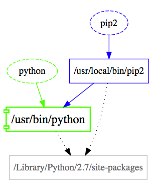

# Pipfix

Python and pip installation analyser and visualiser.

*Visualisation of the Python installation on a vigin Mac (Sierra), 
following the installation of `pip` using `brew install pip`*

## Introduction

Ever been confused about:
- How many versions of `python` you have installed on your mac?
- How many versions of `pip` are there installed?
- Can you mix python.org Python 3 and brew Python 3?
- How to have pip for mac system python and pip for python.org python co-existing at the same time?
- Is there a valid version of `pip` that serves **each** python you have installed?
- Which site-package locations are being used by which python and pip?
- Are any site-package locations (and thus packages) being shared between pythons?

Run this report tool and find out your python installation and pip installation situation.

# Installation

If you don't have brew
- ruby -e "$(curl -fsSL https://raw.githubusercontent.com/Homebrew/install/master/install)"

Brew commands:
- brew install node
- brew install graphviz
- brew install coreutils

Note: `brew install graphviz` is optional because the npm viz module seems to have its own graphviz binaries.  Ubuntu: brew would be replaced with `sudo apt-get install coreutils` etc.

Main installation of pipfix
- git clone https://github.com/abulka/pipfix.git
- cd pipfix
- npm install

Invoke:
- `node pipfix.js --visualise`

A html page will be launched in your browser with reports and graphs.

### Tips
Pipfix looks at the environment it is launched from, so by activating a virtual environment or changing $PATH, you will potentially get different results.

**Pipfix currently doesn't actually fix anything** and is harmless to run.  It only shows graphs and reports - which should be enough for you to see what is going on in your machine and make informed decisions. There is an option to give advice, which is in its infancy.

*Visualisation of a Python 3 installation on a virgin Mac (Sierra)*

## Usage

$ node pipfix.js --help

   pipfix.js 1.0.0 - Reports python installed and any related pips
     
   USAGE

     pipfix.js 

   OPTIONS

     --advice         Generate advice                                                                 optional      
     --report         Generate JSON report                                                            optional      
     --visualise      Visualise as graph in browser                                                   optional      
     --anacondas      Scan for multiple virtual Anaconda pythons (may be slow if you have a lot)      optional       

   GLOBAL OPTIONS

     -h, --help         Display help                                      
     -V, --version      Display version                                   
     --no-color         Disable colors                                    
     --quiet            Quiet mode - only displays warn and error messages
     -v, --verbose      Verbose mode - will also output debug messages    

## Full Sample Report
Sample report output [Go to this page](doco/sample1.pdf)

## Discussion

This tool runs in node.  Why?  I didn't want to run python when trying to report on python. :-)

Some packages e.g. `wxpython` don't work unless you have framework Python installed, which I think means a Python from python.org. So what if you have a Python already installed using `brew`?  Can these python installations co-exist?  What will the /usr/local/pip point to?  

This is why `pipfix` was created, to analyse and report and then for Python developers to look at the results and give some advice re what will happen if you install a particular python distribution.  

This advice will hopefully make its way into `pipfix` so that the tool will warn you about what is likely to happen if you plan to install brew python3 on a system that already has python.org python2/3 on it.

For a discussion of the problem of getting `pipfix` reports for all possible Python installation scenarios [Go to this page](doco/mac_results.md)
